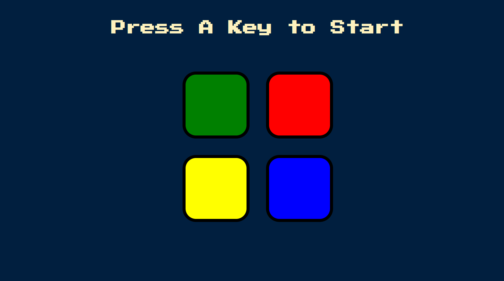

# 🧠 SimonGame  

An interactive **Simon Game** built using HTML, CSS, and JavaScript.  
The system generates a sequence of colored button flashes and sounds, and the player must repeat the sequence.  
Each round adds a new step, testing memory and attention span.

---

## 🌐 Live Demo  
🔗 [Simon Game](https://adityamahekar.github.io/SimonGame/)

---

## 🚀 Features  
- 🟦🟥🟩🟨 Four colored buttons with distinct sounds  
- 🔊 Sound feedback for correct and wrong inputs  
- 🧠 Progressive difficulty with each level  
- 📱 Responsive and interactive interface  
- 🎮 Addictive gameplay with game over detection  

---

## 🛠️ Tech Stack  
- **Frontend**: HTML, CSS, JavaScript  
- **Deployment**: GitHub Pages  

---

## 📷 Gallery  

| Simon Game UI |
|---------------|
|  |

---
